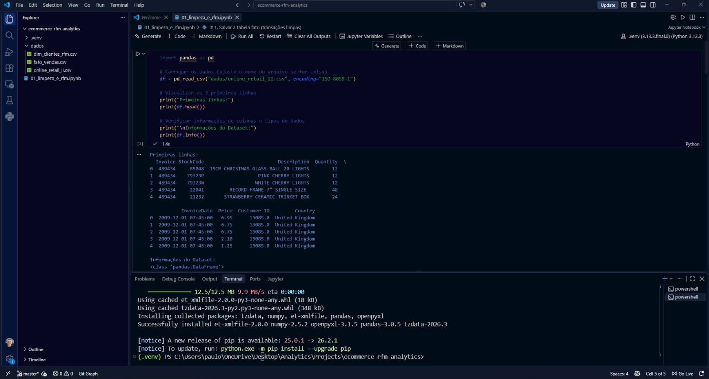
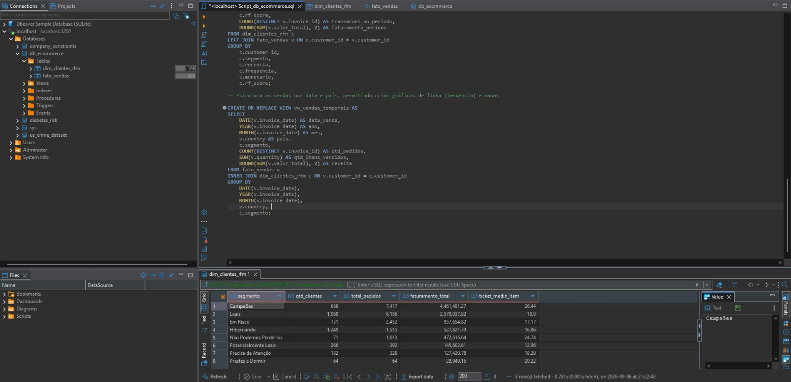

# E-Commerce RFM Analytics 📊

Solução analítica de inteligência de negócios desenvolvida para transformar dados brutos de transações de e-commerce em insights estratégicos para times de marketing e retenção.

---

## 📌 Status do Projeto

- [x] **Etapa 1:** Extração, Limpeza de Dados e Cálculo da Matriz RFM em Python
- [x] **Etapa 2:** Modelagem Dimensional e SQL Analítico para E-Commerce (MySQL - Star Schema)
- [x] **Etapa 3:** Desenvolvimento do Dashboard Executivo Interativo (Power BI)

---

## 🎯 Objetivo de Negócio

Mapear o desempenho de vendas da empresa e categorizar os clientes com base no seu comportamento de compra (**Recência**, **Frequência** e **Valor Monetário**). A partir dessa segmentação, a empresa pode direcionar estratégias como:
* Campanhas de reativação para clientes em risco de *churn*.
* Ações de fidelização e recompensas exclusivas para os clientes *Campeões*.
* Estratégias de incentivo à segunda compra para *Novos Clientes*.

---

## 🛠️ Tecnologias Utilizadas

* **Python 3.13** (Pandas, OpenPyXL, NumPy)
* **Jupyter Notebook** (VS Code)
* **Git & GitHub** (Controle de versão)
* **MySQL / DBeaver**
* **Power BI** (conexão MySQL, modelo semântico e medidas DAX)

## 📊 Etapa 3: Dashboard Power BI (Concluída)

O arquivo [`dashboard/ecommerce-rfm-dashboard.pbix`](./dashboard/ecommerce-rfm-dashboard.pbix) consolida os indicadores comerciais e a segmentação RFM. A conexão, o modelo de dados, as medidas e o procedimento de atualização estão documentados em [`dashboard/README.md`](./dashboard/README.md) e [`dashboard/medidas_dax.md`](./dashboard/medidas_dax.md).

O dashboard utiliza o MySQL como fonte das tabelas `fato_vendas` e `dim_clientes_rfm`, preservando o relacionamento do modelo estrela e permitindo filtros por segmento, país e período.

---

## 📸 Etapa 1: Processamento e Limpeza dos Dados (Concluída)

Nesta primeira fase, tratamos uma base transacional contendo mais de **1 milhão de registros brutos**:

1. **Sanitização de Dados:** Remoção de registros sem ID de cliente, tratamento de valores nulos e filtragem de transações de devolução/cancelamento.
2. **Engenharia de Recursos:** Criação da métrica `ValorTotal` (`Quantity * Price`).
3. **Cálculo da Matriz RFM:** Agrupamento por cliente para calcular os pilares R, F e M.
4. **Segmentação por Quintis:** Divisão estatística (`pd.qcut`) em notas de 1 a 5 e categorização dos perfis de clientes (ex: *Campeões*, *Hibernando*, *Leais*).
5. **Exportação:** Geração das tabelas limpas `fato_vendas.csv` e `dim_clientes_rfm.csv`.

### Registro da Execução (VS Code)


> *Configuração do ambiente virtual (.venv), instalação das bibliotecas necessárias (Pandas, OpenPyXL) e primeiros testes de leitura e visualização da estrutura dos dados.*

---

## 📊 Fase 2: Modelagem Dimensional & SQL Analítico para E-Commerce (Concluída)

Dando sequência ao desenvolvimento do meu projeto end-to-end de Data Analytics, concluí a **Fase 2: Estruturação do Banco de Dados Relacional**.

Após o tratamento e segmentação RFM dos dados transacionais em Python, a missão foi estruturar esse volume em um ambiente pronto para escala e alta performance analítica.

📌 **Principais entregas desta etapa:**

- **Arquitetura Star Schema (Modelo Estrela):** Criação da tabela fato (`fato_vendas` com +425k registros limpos) e tabela dimensão (`dim_clientes_rfm`) no MySQL via DBeaver.
- **Otimização de Carga:** Resolução de gargalos de *batch insert* e integridade referencial para importação performática dos dados.
- **Views Analíticas para BI:** Construção de SQL Views (`vw_rfm_executivo`, `vw_analise_clientes`, `vw_vendas_temporais`) para desacoplar a regra de negócio e otimizar as futuras consultas do Dashboard.

**💡 Insight rápido até aqui:**

O cruzamento das tabelas revelou que apenas o segmento de clientes "Campeões" (menos de 10% da base total) responde por mais de **R$ 4,4 milhões** do faturamento total do e-commerce.

### Registro da Modelagem SQL (DBeaver)



---

## 📂 Estrutura do Repositório

```text
ecommerce-rfm-analytics/
├── .venv/                      # Ambiente virtual Python
├── dados/                      # Arquivos CSV brutos e processados
│   ├── online_retail_II.csv
│   ├── fato_vendas.csv
│   └── dim_clientes_rfm.csv
├── script/                     # Scripts de criação e análise do banco
│   └── Script_db_ecommerce.sql
├── assets/                     # Imagens de registro do projeto
│   ├── notebookCode.jpeg
│   └── script_db_ecommerce.jpeg
├── 01_limpeza_e_rfm.ipynb      # Notebook com código de ETL e segmentação
└── README.md                   # Documentação do projeto
```